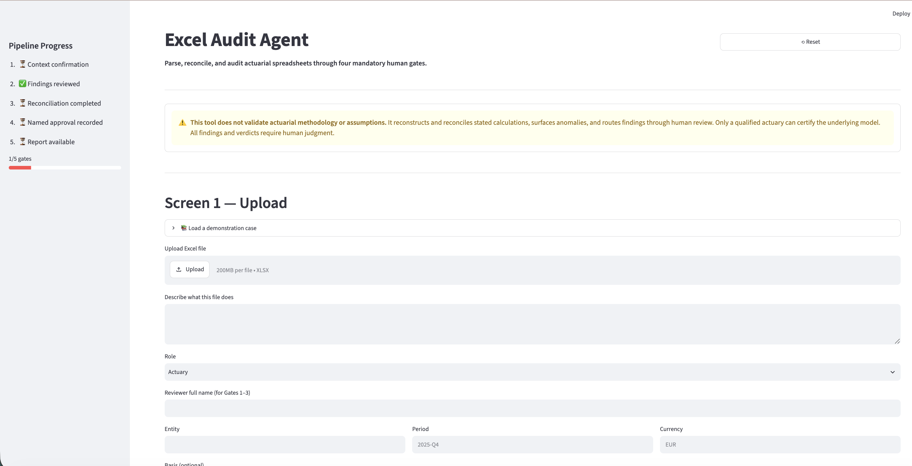
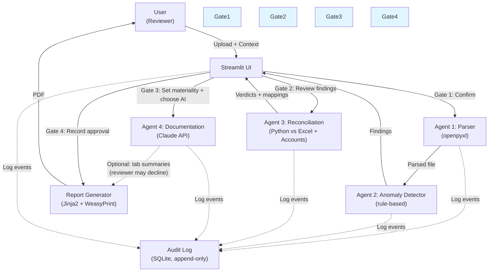

# Excel Translation & Reconciliation Assistant (Glass box)

*A human-governed agentic AI tool for reviewing actuarial and financial spreadsheets.*

**[▶ Watch the demo video](https://www.youtube.com/watch?v=bvdnjimTNCQ)**

---

## The Problem

Actuaries and controllers review complex Excel workbooks by hand: checking that formulas match intent, that intermediate calculations tie out, that assumptions are consistent. Each check is labour-intensive and error-prone. A small mistake in one cell cascades silently through dependent formulas; a hardcoded assumption buried in a large `SUM` range can invalidate an entire calculation. When the workbook feeds an accounts reconciliation, the risk compounds.

This tool automates the legwork — parsing the spreadsheet, reconstructing its logic in Python, comparing the reconstruction line-by-line against both the spreadsheet's own numbers and any accounts figures supplied. It surfaces every discrepancy and assumption as evidence for human review. It does not sign off on anything. It does not replace the actuary's judgment. It makes the judgment possible by doing the part that shouldn't be done by hand.

---

## Interface Preview



**What you see above:** The Streamlit interface showing the landing section with disclaimer, a progress indicator tracking the four human gates across five workflow screens in the sidebar, and Screen 1's workbook upload interface with demo case selector. After uploading, the tool routes findings, reconciliation decisions, and the final approval record through each mandatory human gate.

---

## What the Tool Does

**Parse.** Reads Excel workbooks with `openpyxl`, capturing each cell's formula *and* its cached value together. Records named ranges, external links, VBA presence, and cross-tab dependencies.

**Detect anomalies.** Flags hardcoded literals embedded in formulas, rows mysteriously excluded from `SUM` ranges, cross-tab inconsistencies, and circular references. All detection is rule-based; no LLM is involved.

**Reconstruct.** For supported formulas, independently recalculates the cell's value in Python and compares it to the spreadsheet's cached number. Records the delta. Marks unsupported constructs, such as approximate lookups and array results, as partial reconstructions.

**Reconcile.** Compares designated outputs against accounting figures you supply, using a consistent signed-net convention (debit positive, credit negative). Handles duplicate labels, near-misses, and incomplete mappings as separate evidence, not silent failures.

**Route through gates.** Every finding and every reconciliation decision flows through four mandatory human review points. None can be skipped. All evidence is audit-logged with hash-chain verification.

**Report.** Generates a PDF summarising the workbook's structure, findings, reconstructed values, reconciliation verdicts, and the human decisions that unblocked each gate.

---

## What the Tool Deliberately Does Not Do

**It does not validate the actuarial model.** It does not audit assumptions, check reasonableness, or confirm methodology. Only a qualified actuary can do that.

**It does not certify a number.** The report shows evidence; it does not claim a number is correct. That claim remains the named reviewer's responsibility.

**It does not provide independent assurance.** It does not replace a professional audit or sign-off. It is a step *before* those, not instead of them.

**It does not apply materiality or discount findings.** The threshold for each reconciliation is a human decision, not the tool's choice. A one-penny difference blocks the process just as readily as a major one if that is your threshold.

**It does not handle all formula types.** `VLOOKUP`, `INDEX`, and `MATCH` are supported for exact match only (see Group E below); their approximate-match modes, array formulas, and other complex constructs are flagged as unsupported. The tool will not guess their value.

---

## Supported Formula Catalogue

The reconstruction engine supports 26 functions across nine groups:

**Group A — Basic arithmetic (2 functions)**
- `ABS` — absolute value
- `INT` — integer (floor towards negative infinity)

**Group B — Rounding (5 functions)**
- `ROUND` — round to nearest, with exact halves rounded away from zero as Excel does
- `ROUNDUP` — round away from zero
- `ROUNDDOWN` — round towards zero
- `CEILING` — round up to significance multiple
- `FLOOR` — round down to significance multiple

**Group C — Conditional aggregation (8 functions)**
- `SUM` — sum a range (blank cells treated as zero)
- `SUMIF` — conditional sum with criteria
- `SUMIFS` — sum with multiple criteria
- `COUNTIF` — count matching cells
- `COUNTIFS` — count with multiple criteria
- `AVERAGEIF` — average matching numeric cells (excludes blanks)
- `AVERAGEIFS` — average with multiple criteria
- `IF` — conditional branching on comparison expressions

**Group D — Min/Max with criteria (2 functions)**
- `MINIFS` — minimum of matching numeric cells
- `MAXIFS` — maximum of matching numeric cells

**Group E — Lookup functions, exact match only (4 functions)**
- `VLOOKUP` — exact-match column lookup (`range_lookup` must be `FALSE`; omitted or `TRUE` is reported as unsupported, since this tool does not verify the lookup column is sorted and will not silently trust an approximate match)
- `MATCH` — exact-match position lookup (`match_type` must be `0`; the default `1` and `-1` are unsupported for the same reason)
- `INDEX` — scalar lookup by row/column position within a 1D or 2D range (returning a whole row/column via `row_num`/`col_num` of `0` is an array result and out of scope)
- `XLOOKUP` — exact-match lookup with flexible return array (`match_mode` 0 only; +/-1 assume sorted data and are unsupported; `search_mode` +/-1 both supported, +/-2 unsupported for consistency with the sortedness posture; `if_not_found` is parsed but not used, so a miss is unsupported like VLOOKUP/MATCH)

A matched lookup cell (from any of these four functions) that holds text, rather than a number, is also reported as unsupported: every function in this catalogue feeds its result back into further arithmetic, which cannot carry a text value through. This constraint bites particularly often for XLOOKUP, which is idiomatic for text lookups.

**Group F — Logical (2 functions)**
- `AND` — returns 1.0 if all arguments are true, 0.0 if any is false; all arguments evaluated (no short-circuit) for full verification
- `OR` — returns 1.0 if any argument is true, 0.0 if all are false; all arguments evaluated for full verification

**Group G — Array product (1 function)**
- `SUMPRODUCT` — sums the element-wise products of ranges (all input ranges must have matching dimensions; text and blank cells coerce to 0, TRUE/FALSE to 1/0, per Excel's own SUMPRODUCT semantics, distinct from this catalogue's other functions)

**Group H — Time-value-of-money (1 function)**
- `NPV` — net present value of periodic cash flows at a fixed rate (matches Excel's exact `NPV` convention: the first cash flow is discounted at period 1, not period 0; an initial time-0 outflow is the caller's own responsibility to add outside the call, same as in Excel; text/logical cells in a range are skipped, not zero-filled, so later flows shift down by one period if an earlier cell is non-numeric)

**Group I — Index-based selection (1 function)**
- `CHOOSE` — returns one of N values based on a 1-based integer index (fractional indices truncate toward zero; only the selected value is evaluated, matching Excel's lazy evaluation; a selected value resolving to text is unsupported, the same architectural constraint as VLOOKUP/INDEX/XLOOKUP)

### Implementation notes

**Group F (AND, OR):** All arguments evaluated (no short-circuit) for full verification. Fixed IF/AND/OR condition-evaluation bug: unresolvable conditions now properly unsupported instead of silently guessed as False.

**Group G (SUMPRODUCT):** Row-major range expansion, dimension-mismatch fail-closed. Text/blank/boolean coercion matches Excel's documented SUMPRODUCT semantics.

**Group H (NPV):** Excel's exact timing (period 1, not 0). Text/logical cells skipped without zero-filling per Excel's documented behavior.

**Group I (CHOOSE):** Lazy evaluation of only selected branch. Fractional index truncates toward zero, matching Excel exactly.

**Group E extended:** XLOOKUP joins VLOOKUP/MATCH/INDEX for exact-match lookup. All four share the "matched text is unsupported" architectural constraint.

**Out of scope:** array formulas (including CSE array formulas and dynamic-array spill behavior) remain unsupported at every group.

---

## Deployment Posture

**Default and recommended: run locally.** `audit.db` and any uploaded workbooks stay on your machine. The only thing that can leave is the optional Anthropic API call for tab documentation, and only if you explicitly opt in at Gate 3 (see **Optional AI documentation and what leaves the machine** below).

**Docker:** The same trust boundary applies only if the `/data` volume remains on the same machine. Do not mount it from network storage or sync it to cloud storage without separately considering that exposure.

**Hosted deployment is not recommended without additional access control.** This tool has no application-level authentication. A hosted instance would be reachable by anyone with the URL. If hosting is genuinely needed, that remains post-MVP scope and requires real authentication.

---

## Five-Minute Demonstration

1. **Start the application.**
   ```
   pip install -r requirements.txt
   streamlit run app.py
   ```
   Open `http://localhost:8501`. Setting `ANTHROPIC_API_KEY` is **optional** — only needed if you choose Agent 4's AI documentation at Gate 3; the full deterministic pipeline runs without it.

2. **Load a demonstration case (optional).**
   On Screen 1, expand "📚 Load a demonstration case" and select **Case 4** (claims reserve roll-forward — the principal competition demonstration; see "Six Demonstration Cases" below). The UI fills with synthetic data — entity, period, currency, and reference figures. If you had already uploaded a file before loading the case, the upload stays active; the "Workbook identity" panel's **Active source** line always tells you which one (upload or demo case) is actually about to be audited.

3. **Confirm context (Gate 1).**
   Review the displayed context summary and the workbook identity panel (filename, size, SHA-256, active source). Under "Add reference figures", if you're following Case 4, set the **"Signed net control total"** to `-1400000` and check "I confirm this extract ties to the control total above" — this field has no default and, left unset or wrong, blocks Gate 3 with a discrepancy even when every individual line reconciles. Check the checkbox "I confirm that the workbook and reference-figure context shown above is accurate." Click "Start audit". The parser runs; findings appear on the next screen.

4. **Review findings (Gate 2).**
   For each finding, click "Confirm", "Override", or "Dismiss". If overriding or dismissing, enter a reason. Designate one or more output cells to reconcile (e.g., the final reserve total). Click "Submit all decisions".

5. **Set materiality thresholds and choose AI documentation (Gate 3).**
   The tool shows internal consistency (Excel vs. Python) and accounts reconciliation (Python vs. supplied figures) side by side. Set materiality thresholds for each — the UI suggests 1%, but the choice is yours. Review proposed account mappings. Read the AI documentation disclosure and explicitly choose "Use optional Claude documentation" or "Continue without AI documentation" — neither is preselected. Click "Confirm reconciliation".

6. **Record named approval (Gate 4).**
   Enter your name. The application displays the matching role from its local authorized-approvers registry; the role is not free text. Click "Record approval". The PDF is generated and ready for download. This is a local identity confirmation only, not authentication.

7. **Download and verify.**
   Click "Download PDF". The report contains the full audit trail, source mappings, and all human decisions.

---

## Six Demonstration Cases

All demonstration workbooks are entirely synthetic. No real client, policyholder, insurer, ledger, or production data is included.

**Case 1: Clean reserve calculation**
- File: `demo/workbooks/case_1_clean_reserve_calculation.xlsx`
- Reference figures: `demo/reference_figures/case_1_reference_figures.csv`
- What it shows: A workbook where all calculations match reference figures perfectly. Internal verdict: pass. External verdict: pass. Expected outcome: PDF download with no reconciliation blocks.

**Case 2: Spreadsheet control failures**
- File: `demo/workbooks/case_2_spreadsheet_control_failures.xlsx`
- Reference figures: None (intentional).
- What it shows: Circular references, hardcoded assumptions, a deliberately unsupported approximate `VLOOKUP`, and a row visibly excluded from a `SUM` range. Internal verdict: incomplete (due to the unsupported lookup mode). External verdict: not performed (no reference figures). Expected outcome: Gate 3 blocks until you explicitly acknowledge the incomplete reconstruction.

**Case 3: Accounting reconciliation failure**
- File: `demo/workbooks/case_3_accounting_reconciliation_failure.xlsx`
- Reference figures: `demo/reference_figures/case_3_reference_figures.csv` (intentionally in GBP while the workbook claims EUR).
- What it shows: Numerically matching figures with a currency mismatch. Internal verdict: pass (figures match). External verdict: block (context mismatch prevents reliance on the accounts reconciliation). Expected outcome: Gate 3 stops the pipeline; the report names the mismatch as evidence.

**Case 4: Claims reserve roll-forward and GL reconciliation**
- File: `demo/workbooks/case_4_claims_reserve_roll_forward.xlsx`
- Reference figures: `demo/reference_figures/case_4_reference_figures.csv`
- What it shows: An actuarial claims-reserve movement (opening reserve, incurred claims, paid claims, assumption strengthening, FX) rolled forward to a closing reserve, then bridged to a signed general-ledger credit balance at `Controls!B4`. The reserve magnitude is always non-negative; the credit orientation carries the sign, so `Controls!B4` is `-1,400,000` against a workbook closing reserve of `+1,400,000`. Internal verdict: pass. Proposed mapping requires explicit human approval before the external verdict can be `pass`. AI documentation is optional here, not mandatory. This is a synthetic workflow demonstration, not IFRS 17 methodology validation, and reproducing this result is not a claim of actuarial methodology validation.

**Case 5: Supported formula demonstration**
- File: `demo/workbooks/case_5_supported_formula_demonstration.xlsx`
- Reference figures: `demo/reference_figures/case_5_reference_figures.csv`
- What it shows: A user-facing workbook with one designated output for every function in the live 26-function catalogue. All 26 supported outputs reconstruct completely and reconcile after the human approves each proposed mapping. A separate scope-boundary tab proves that approximate lookup and `OFFSET` remain explicitly partial and incomplete.

**Case 6: Reserve stress and solvency impact**
- File: `demo/workbooks/case_6_reserve_stress_business_impact.xlsx`
- Reference figures: `demo/reference_figures/case_6_reference_figures.csv`
- Benchmark: `benchmark/CASE_6_BENCHMARK_REPORT.md`
- What it shows: A 300-cohort, 8,453-formula baseline-versus-adverse reserve stress. Technical provisions increase by EUR 2,330,154.10, synthetic available own funds fall by the same amount, and the illustrative solvency ratio falls from 181.68% to 175.03%. The workbook is not a full actuarial model and does not implement or validate certified Solvency II or IFRS 17 methodology.

## Competition Use-Case Evidence Pack

[`demo/final cases/`](<demo/final cases/>) is a separate, reproducible evidence
pack for live judging. It contains generated clean/defective IFRS 17-style
cohort cases, a Solvency II capital-decision case, an intentionally incomplete
life-pricing reconstruction, and the principal wrong-accounting-context refusal
case. Each implemented case includes the recalculated workbook, applicable
reference CSV, explicit expected results, complete formula inventory, SHA-256
manifest and a verification guide.

Cases 7a–11 are listed in Streamlit's **Load a demonstration case** dropdown.
Cases 7a–10 load their synthetic artifacts through the normal four-gate journey;
Case 11 displays its protocol-only status and does not load a workbook.

Case 11 is protocol-only: no challenge workbook has been authored or inspected
by the developer. Its independent-author brief, frozen public formula scope,
sealed-results protocol, first-run checklist, scorecard and evidence tools are
in [`demo/final cases/case_11_independent_challenge/`](<demo/final cases/case_11_independent_challenge/>).
The challenge must be performed against a separately frozen and tagged release;
imperfect first-run evidence is preserved rather than rewritten.

---

## Architecture



---

## The Four Human Gates

None of these can be skipped or merged. Each is enforced in [`core/gates.py`](core/gates.py), which raises `GateBlockedError` rather than passing silently.

### Gate 1: Context Confirmation

Before anything is parsed, confirm the workbook filename, description, reviewer identity, accounting context (entity, period, currency, basis), and any reference figures. This confirmation is bound to the SHA-256 of the exact bytes uploaded — a short form for the eye, the full 64 characters beneath, reproducible with `shasum -a 256`. Uploading a different file clears the confirmation, even if it has the same name. The bytes confirmed here are the exact bytes the parser reads; they are never written to an intermediate file.

**Unblocks:** Explicitly check the confirmation box and click "Start audit".

### Gate 2: Findings Review and Output Designation

Every anomaly is shown individually. For each finding, you confirm it is a real issue, override it with a reason, or dismiss it as a false positive with a reason. All three are valid dispositions. Additionally, designate which output cells should be reconciled (typically the final reserve total, the provision amount, etc.).

**Unblocks:** Every finding has a disposition, and at least one output cell is designated.

### Gate 3: Reconciliation Sign-Off

The tool shows two independent comparisons:
- **Internal consistency:** Its own Python reconstruction vs. the spreadsheet's cached values.
- **Accounts reconciliation:** The Python results vs. the accounting figures you supplied (or "not performed" if none were supplied).

You set a materiality threshold for each comparison. The UI suggests 1%, but the choice is entirely yours. A blocking discrepancy in either comparison stops the process.

**Unblocks:** Materiality thresholds are set, and any blocking discrepancies are resolved (or you acknowledge incomplete reconstruction with an explicit checkbox).

### Gate 4: Named Approval Record

A named person enters their name. Gate 4 resolves exactly one matching CRO entry in the local authorized-approvers registry and stores the canonical registry name and role with a timestamp. The role is not entered as free text. This is a local identity confirmation only, not authentication.

**Unblocks:** The name resolves to exactly one well-formed CRO registry entry and the record is submitted. The PDF is then generated and available for download.

---

## AI Versus Deterministic Responsibilities

This table makes explicit where the AI is involved and where the decisions are entirely deterministic or human.

| Component | Responsibility | Notes |
|-----------|---|---|
| Parsing the workbook | Deterministic Python | Uses `openpyxl`; no LLM. Captures formulas and cached values together. |
| Detecting anomalies (hardcoded literals, circular refs, etc.) | Deterministic Python | Rule-based; no LLM. Detects specific patterns. |
| Reconstructing formulas in Python | Deterministic Python | Supported formulas only. Unsupported formulas marked as partial. |
| Reconciling Python output against accounts figures | Deterministic Python | Uses signed-net convention (debit +, credit −). Exact equality or materiality threshold—no LLM judgment. |
| Drafting tab documentation (method, assumptions, data sources) | AI-generated, **optional** | Claude generates plain-language summaries only if the reviewer explicitly opts in at Gate 3. Declining sends nothing and does not block the report. Data sent when enabled is minimized per `core/llm_data_policy.py`, but the filter is a heuristic, not a certified privacy control — see "Optional AI documentation" above for the exact categories sent. |
| Confirming context (Gate 1) | Human decision | Reviewer verifies the workbook bytes and context. |
| Disposing of findings (Gate 2) | Human decision | Reviewer confirms, overrides, or dismisses each anomaly. |
| Setting materiality thresholds (Gate 3) | Human decision | Thresholds are never chosen by the tool. |
| Recording approval (Gate 4) | Human decision | Reviewer enters their name; the canonical name and role are derived from the local registry. This confirms a local registry match, not authentication. |

---

## Synthetic Demonstration Scope

**Status:** Synthetic test cases and a reproducible large-workbook benchmark are included. No result in this repository is evidence about real customer workbooks or multi-user production load.

The six demonstration cases above are well-understood synthetic workbooks designed to exercise the full pipeline's distinct paths:

- **Case 1 (clean):** no findings; internal and external reconciliation pass after mapping approval.
- **Case 2 (control failures):** three findings and an incomplete reconstruction caused by an unsupported approximate lookup.
- **Case 3 (accounts mismatch):** internal reconstruction passes while a currency mismatch blocks external reconciliation.
- **Case 4 (reserve roll-forward):** a signed general-ledger bridge that passes after mapping approval.
- **Case 5 (formula catalogue):** all 26 supported functions in a user-facing, fully reconciled workbook, plus explicit unsupported boundaries.
- **Case 6 (reserve stress):** a realistically sized synthetic calculation that quantifies reserve, own-funds and solvency-ratio impact.

The formula qualification workbook under `tests/fixtures/` remains the test-only acceptance fixture. Case 5 makes the same declared function scope understandable and runnable through the actual user journey. A separate synthetic IFRS 17-related test fixture contains 10,847 formula cells, while the user-facing Case 6 contains 8,453 formula cells and an explicit business-impact bridge. Reproduce the established fixture benchmark with `python scripts/benchmark.py`; reproduce the Case 6 benchmark with `python scripts/benchmark_demo_case_6.py --runs 5`. The recorded environments and limitations are in `benchmark/BENCHMARK_REPORT.md` and `benchmark/CASE_6_BENCHMARK_REPORT.md`.

**Production scale:** Not established. One synthetic workbook with more than 10,000 formula cells has been measured, but real workbooks of varying size and complexity, concurrent users and hosted workloads remain untested.

---

## Validation and Qualification Evidence

The [validation report](validation/VALIDATION_REPORT.md) brings together the acceptance matrix, large-workbook control totals, six-defect detection matrix, benchmark results, implementation defects found, remaining limitations and exact reproduction commands.

- `tests/fixtures/qualification_manifest.json` binds the recalculated formula fixture to its LibreOffice version, SHA-256 and cell-level formula manifest.
- `tests/fixtures/ifrs17_manifest.json` records the large fixture's seed, scale, function inventory, authoritative outputs and recalculation provenance.
- `benchmark/BENCHMARK_REPORT.md`, `benchmark/summary.csv` and the five raw JSON files under `benchmark/runs/` preserve the measured evidence without imposing timing thresholds on CI.
- `benchmark/CASE_6_BENCHMARK_REPORT.md` and `benchmark/case_6_summary.json` record the separate user-facing Case 6 timing, memory, formula-volume and business-impact evidence.
- `tests/test_evidence_integrity.py` blocks function-catalogue, README, demo-contract and acceptance-coverage drift.

All files contain synthetic data. This evidence qualifies the declared reconstruction scope only. It does not establish Microsoft Excel equivalence, production readiness, IFRS 17 methodology validation or an audit opinion.

---

## Installation

### Requirements

- **Python 3.11 or 3.13** — the two versions actually tested, in CI and locally (3.11 is also the Docker runtime). Other versions are untested; do not assume they work.
  - macOS: `brew install python@3.11`
  - Linux: `apt install python3.11` (Debian/Ubuntu) or equivalent
  - Windows: [Official installer](https://www.python.org/downloads/windows/) or `winget install Python.Python.3.11`
- **Optional:** an Anthropic API key, needed only if you choose to use Agent 4's AI-generated documentation. The full deterministic pipeline (Agents 1–3, all four gates, the PDF report) runs and completes with no API key at all — declining AI documentation is a normal, supported path, not a degraded one.
- On Linux/Docker: Pango and GDK-PixBuf libraries (the Dockerfile installs these).

**Test-only dependency:** Regenerating test fixtures requires LibreOffice (not needed to run the app or test suite; fixtures are pre-calculated). See [FIXTURE_MIGRATION.md](FIXTURE_MIGRATION.md).

### Local Setup

```bash
git clone https://github.com/ISHUKLA/Excel-Audit-agent.git
cd Excel-Audit-agent
pip install -r requirements.txt
cp .env.example .env
# Edit .env and add your ANTHROPIC_API_KEY
streamlit run app.py
```

Open `http://localhost:8501`.

---

## Docker

### Build and Run

```bash
docker build -t excel-audit-agent .

mkdir -p .local-data
chmod 700 .local-data

docker run --rm -p 127.0.0.1:8501:8501 \
  --env-file .env \
  --mount type=bind,source="$(pwd)/.local-data",target=/data \
  excel-audit-agent
```

The audit log (`/data/audit.db`) is persisted to `.local-data` on your machine.

---

## Test Status and CI

```bash
pytest tests/           # Full suite
pytest tests/test_parser.py -v
```

The current pass count is deliberately not hardcoded here. Run `python3 -m pytest tests/ -v -rsx -p no:cacheprovider`, or inspect the linked CI run for the exact result associated with a commit.

[](https://github.com/ISHUKLA/Excel-Audit-agent/actions/workflows/ci.yml)

CI runs the full suite on Python 3.11 (matching the Docker runtime) and Python 3.13 on every push and pull request to `main`, plus a Docker build-and-health-check smoke test. The badge above and the numbers it links to reflect GitHub's own record of those runs; they are evidence only after a workflow run has actually completed on `main` — a local `pytest` pass reported in this file is not GitHub CI evidence on its own.

The test suite covers:
- Clean workbooks and messy input (blank tabs, broken formulas, inconsistent labels).
- Append-only audit log behaviour.
- End-to-end flow through all four gates.
- Restart recovery and chain verification.
- Boundary cases: exact matching, materiality thresholds, incomplete reconstructions, context mismatch.

**Not covered:** Live Anthropic API calls (mocked in tests), Microsoft Excel equivalence, real customer workbooks, concurrent load and hosted production operation.

---

## Security and Data Handling

### Optional AI documentation and what leaves the machine

**Claude documentation (Agent 4) is optional and off by default in the sense that nothing is
transmitted until you explicitly say so.** At Gate 3, before any Anthropic call can be made, you
choose either "Use optional Claude documentation" or "Continue without AI documentation." Neither
option is preselected, and rendering the screen makes no call. Declining does not block anything:
findings, reconciliation, verdicts, Gate 4, and PDF generation all work identically either way.

If you choose to use it, an Anthropic API call is the only thing that sends data outside your
machine, and the payload for each included cell contains:

- Tab names.
- Cell references for included cells.
- **Exact formula text, including any embedded string literals.**
- **Cached numeric cell values.**
- **Short text cell values below the current 40-character threshold** (this can include short
  labels).
- The cell's data type and stale-state indicator.
- In-tab named-range names.
- The designated authoritative-output cell references.
- Your professional role category, communicated through role-specific system-prompt guidance.

**Correction:** earlier documentation in this project stated that cell values, amounts, and
account labels were withheld. That was inaccurate. Cached numeric values and short text cells
(including short labels) are sent when they are not otherwise excluded. Short text and formula
literals may contain personal, client, account, or commercially sensitive information. The rule
that withholds long free text (≥40 characters) and external-link formulas is a length/pattern
heuristic — it is **not** a PII detector and **not** a certified privacy control.

**Genuinely never sent** through this documentation payload, whether or not you opt in: the
complete workbook file bytes; reference-figure amounts, account numbers, or account labels
(`ReferenceFigures` is never passed to the documentation payload builder); accounting mappings;
materiality thresholds; reviewer name; entity; reporting period; currency; accounting basis; long
non-formula text (≥40 characters); and formulas recognised as external-workbook links, or their
paths. See [`core/llm_data_policy.py`](core/llm_data_policy.py) for the exact filtering rules and
the full disclosure text shown at Gate 3.

**Competition demonstrations use synthetic data only.** Real or sensitive company data is outside
this prototype's approved use unless separately authorised and governed — the demo cases shipped
with this repo are entirely fictional (see "Six Demonstration Cases" above).

### What Stays Local

- The entire workbook (bytes, formulas, cached values).
- All audit evidence.
- All reference figures and accounting mappings.
- The audit log (`audit.db`).

`audit.db` is as sensitive as the workbook itself. Once a file is processed, its contents live durably in the database. Apply the same access controls, disposal policies, and care as you would to the original `.xlsx`.

### Audit Log: Tamper-Evident, Not Tamper-Proof

The log is append-only with hash-chain verification. Any later modification to a row breaks the chain and is detectable on verification. However, someone with file access can still modify or delete `audit.db`; the hash chain makes after-the-fact changes detectable but cannot prevent them. Recovery verifies the complete chain before any snapshot is loaded; one corrupt row makes every report in that `audit.db` unresumable.

Backups are an operational necessity, not merely good practice.

---

## Calculation Freshness Provenance

**A cached formula value is not proof that a workbook was ever recalculated.** Excel and other spreadsheet applications happily save a formula whose cached value has never been refreshed after an edit, and manual calculation mode means Excel itself will not recompute values until a human asks it to. This tool cannot know what happened inside Excel before the file reached it — it can only read what the file honestly records.

**What "not flagged stale" means, and does not mean.** A cell's calculation evidence is `stale` when its cached value is missing, or the workbook's calculation mode is manual; it is `unknown` when the calculation mode cannot be determined at all — an absent `calcPr` element is read as `unknown`, never assumed to be `automatic`. Only when a formula cell has a cached value under a *confirmed* automatic calculation mode does this tool describe it as **not flagged stale**. That phrase is deliberate: it states that no known staleness indicator was detected under this prototype's rules. It does **not** mean "verified fresh" or "freshly recalculated," and it does not prove when, how, or with which engine the workbook was last calculated, or that it was saved after that calculation. Any formula cell that is stale or freshness-unknown — including one buried in the derivation chain beneath an output that looks fine on its own — prevents that comparison from reading as a pass, regardless of how closely the numbers agree and however loose the materiality threshold is; a reviewer can acknowledge the resulting incomplete result to continue to a report, but that acknowledgement does not and cannot make the evidence fresh.

**Synthetic fixture recalculation.** The original parser fixtures and competition demonstration workbooks were recalculated once at build time; their evidence is recorded in [`demo/recalculation_provenance.json`](demo/recalculation_provenance.json). The formula qualification and large IFRS 17-related fixtures have separate manifests at `tests/fixtures/qualification_manifest.json` and `tests/fixtures/ifrs17_manifest.json`, including their LibreOffice version, exact SHA-256 and formula inventory. **This is not a capability of the running application.** The application itself never invokes LibreOffice, Microsoft Excel, or any other recalculation engine at runtime. It never recalculates an uploaded workbook. It reads that workbook's calculation mode and cached values exactly as supplied, and nothing more can be inferred about when, how or with which engine the workbook was last calculated.

---

## Known Limitations

- **No independent reviewer enforced.** The same person can complete all four gates.
- **No application-level authentication.** Gate 4 provides a visible local identity confirmation by matching a typed name to the authorized-approvers file and deriving the stored role from that entry. It does not authenticate who typed the name.
- **Audit log is tamper-evident, not tamper-proof.** Someone with file access can modify `audit.db`; verification detects this after the fact.
- **Chain verification does not defend against wholesale forgery.** Detecting that would require an anchor held outside the file.
- **Whole workbook held in memory.** A very large file will consume proportional memory. No maximum upload size is enforced.
- **Data minimization is informal, and only relevant if you opt in.** AI documentation is off until you explicitly choose it at Gate 3. When chosen, the local policy withholds long free text and external-link formulas and records a manifest, but cached numeric values and short text cells are sent, and the filter is a length/pattern heuristic — not a certified privacy or regulatory control.
- **A "not flagged stale" cell is not proof of recalculation.** The tool does not perform fresh workbook recalculation of anything a reviewer uploads, and cannot prove when or with which engine an uploaded workbook was last calculated — only that no known staleness indicator was detected. An incomplete result (whether from staleness or partial formula support) is not validation, and acknowledging it does not change the verdict.
- **Synthetic test fixtures only.** The test suite uses fictional workbooks; real-world performance and edge cases remain untested.

---

## Use of AI in Development

This tool was built with assistance from Claude (Anthropic's language model). This section documents where AI was used, what was human-directed, and what remains human-reviewed.

### What Was AI-Written

**Agents 1–4 and the orchestrator:** All four parsing/anomaly/reconciliation/documentation agents, the orchestrator that sequences them, and the Pydantic models that validate their outputs were written by Claude following human-specified rules.

**Audit log and state store:** The hash-chained audit log (append-only SQLite with tamper-evident verification) and the state snapshot store were AI-written to specification.

**Reconciliation logic:** The two-pass reconciliation (Excel vs. Python, Python vs. accounts), mapping proposal flow, and verdict computation were AI-written and thoroughly tested.

**Test suite:** Tests covering clean cases, messy input, boundary conditions, qualified real-workbook formulas, a large synthetic workbook and end-to-end flows were AI-written. See "Test Status and CI" above for the commit-specific result.

**Streamlit interface and PDF report:** The five-screen UI, gate enforcement, and PDF report generation via Jinja2 + WeasyPrint were AI-written.

**Docker, CI, and deployment:** The Dockerfile, GitHub Actions CI workflow, and deployment configuration were AI-written.

**Phase 3 UI polish:** The Streamlit enhancements (progress indicator, responsibility badges, demo case selector, findings sorting, executive summary, AI transparency panel, reset button) were AI-written.

**Documentation and README:** This README and supporting documentation (CLAUDE.md, SCOPE_INVENTORY.md, FIXTURE_MIGRATION.md) were AI-written.

### What Was Human-Directed

Every element above was written *to a human-specified design*. The human author provided:

- **Rules, not recipes.** Operating principles from [CLAUDE.md](CLAUDE.md) (e.g., "never skip a gate", "no invented data", "tamper-evident not tamper-proof").
- **Acceptance criteria.** What each test must verify, what each gate must block, what evidence the audit log must preserve.
- **Architecture decisions.** Four gates, two reconciliation passes, data minimization before LLM calls, append-only audit log.
- **Boundary decisions.** Which formulas to support, what constitutes a finding, how to handle duplicate labels.
- **Review and sign-off.** Every module was reviewed before moving to the next; gaps were identified and closed before release.

### What Remains Human-Reviewed

- **AI output in Agent 4 (documentation).** Claude writes plain-language tab summaries in the PDF. These are shown to the reviewer but do not drive any decision; they are explanatory text only. The real evidence is the parsed workbook, detected anomalies, and reconciliation deltas.
- **Gate decisions.** Every decision at each of the four gates is made by a named human: context confirmation, findings disposition, materiality thresholds, approval record.
- **Findings and reconciliation.** Agents 1–3 produce deterministic output (parsed data, rules-based anomalies, numeric deltas). Humans decide whether these constitute issues and what to do about them.

### Implications

- **The tool is not autonomous.** It surfaces evidence; humans govern the evidence.
- **AI is not in the approval path.** No gate is automatically satisfied or bypassed by an AI decision.
- **Code is traceable.** Every line can be read and understood; the logic is deterministic where it matters (parsing, anomaly detection, reconciliation).
- **This is disclosed in the tool itself.** The UI shows a responsibility badge on every output section: "Deterministic Python calculation", "AI-generated explanation", or "Human decision required".

See [CLAUDE.md](CLAUDE.md) for the full development methodology, rule set, and build order.

---

## Roadmap

The current release (v1.0.0) ships the four-gate pipeline, local-first deployment, and an audit log with hash-chain verification. Post-MVP scope includes:

- **Hosted operation with real authentication.** Application-level access control for multi-user deployments.
- **Performance benchmarks on real workbooks.** Testing against production files of varying size and formula complexity.
- **Extended formula support.** Approximate lookups, array formulas, dynamic arrays and other constructs currently marked unsupported.
- **Configurable data minimization.** Allow administrators to set their own policies for what is sent to the LLM.
- **Batch mode.** Process multiple workbooks in a single run without the Streamlit UI.

---

## Licence

[See LICENCE file.](LICENCE)

---

## Contact and Attribution

**Author:** Isaac Shukla  

This tool was built with assistance from Claude Code (Anthropic). See [CLAUDE.md](CLAUDE.md) for the operating rules and build history.

---
